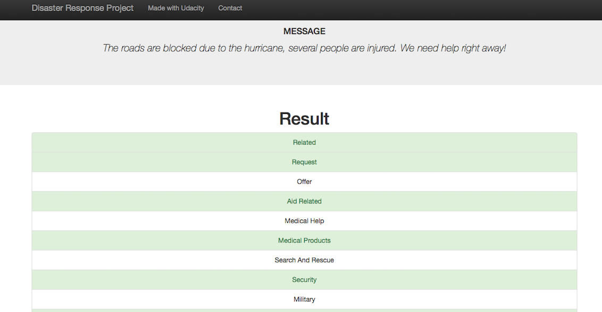
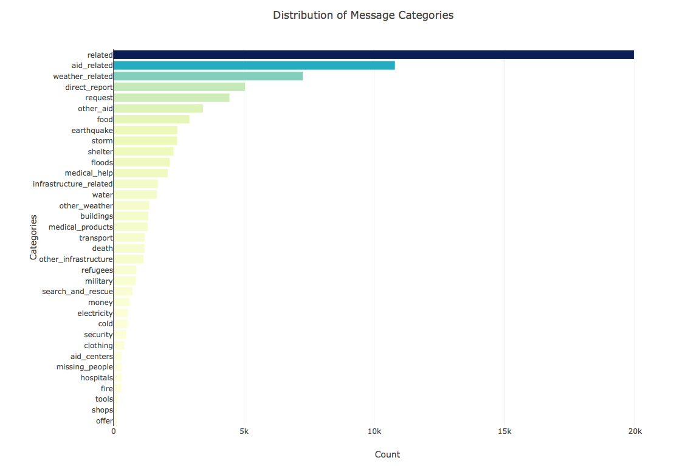
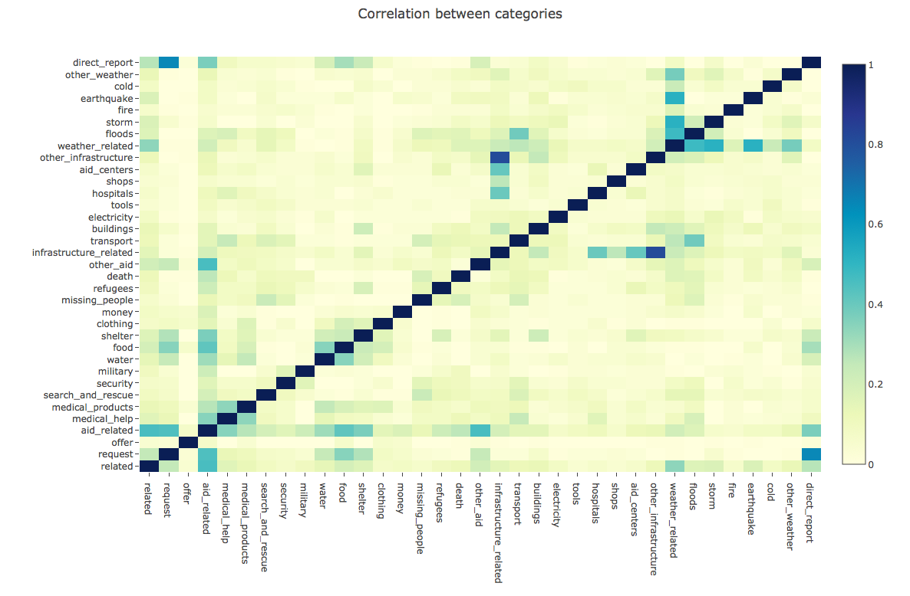

# disaster_messages_categorization

# Table of contents
- [Purpose](#purpose)
- [Web Application](#web-application)
- [Data](#data)
- [Installation](#installation)
- [Usage](#usage)
- [Project structure](#project-structure)
- [Discussion of the results](#discussion-of-the-results)
- [Author](#author)
- [Credits](#credits)
- [Requirements](#requirements)

# Purpose
A web application that can categorize messages into 36 independent related to disaster response themes (like 'medical_help', 'weather_related' and etc.) based on training data messages that were sent during disasters around the world.

# Web Application
The app is hosted at https://disaster-message-category.herokuapp.com/ 
 
Instructions:
1. Enter a message to classify in the search box and hit 'Classify Message' button 

2. The application returns the list of categories with relevant categories highlighted

# Data
The training data comes from Figure Eight's (Aspen) dataset that can be found at https://appen.com/datasets/combined-disaster-response-data. It is a dataset of thousands of messages (more than 26 000) collected during natural disasters from various sources. 
For each message there are 36 possible categories (like 'medical_help', 'weather_related' and etc.)

# Installation
1. In order to install the code and deploy the app locally please download from Github: `git clone https://github.com/alibekU/disaster_messages_categorization.git`.
2. You may want to set up a new virtual environment: `python3 -m venv /path/to/new/virtual/environment` 
3. Then, use pip to install all the needed packages: `pip install -r requirements.txt`

# Usage
After downloading, go to the the 'disaster_messages_categorization' folder and:
1. Run the following commands in the project's root directory to set up your database and model.

    - To run ETL pipeline that cleans data and stores in database
        `python data/process_data.py data/messages.csv data/categories.csv data/Disaster_response.db`
    - To run ML pipeline that trains classifier and saves
        `python models/train_classifier.py data/Disaster_response.db models/classifier.pkl`

2. **Go to the app/ directory** and run the following command to launch your web app. 
    `python run.py`

3. Go to http://0.0.0.0:3001/

# Project structure 
data\  
-process_data.py - ETL for the data: from csv files to sqlite db, plus computing and saving data for web app visuals in the db. Invoked only once before web app deployment.  
-messages.csv - a CSV with messages  
-categories.csv - a CSV with labels - message categories  
-Disaster_response.db - an sqlite DB file  
models\  
-train_classifier.py - ML pipeline that trains and tunes a model for classification, and then stores the model in a file for future use by web app. Invoked only once before web app deployment.  
-support_functions.py - additional functions< br/>
-classifier.pkl - a Pickle file, saved classification model  
app\  
-run.py - the main script of Flask web app  
-support_functions.py - additional functions  
-templates\  
 --master.html - main html page template  
 --go.html - a template for displaying result of classification - list of categories with highlightment of relevant ones  
images\ - pictures for the README file  
-requirements.txt - a list of required PIP packages, result of `pip freeeze` command  
-nltk.txt - a list of NLTK modules to be downloaded at Heroku server for usage in the code  
-Procfile - code for Flask app launch at Heroku  
-ML Pipeline Preparation.ipynb - a Jupyter notebook with ML pipeline exploration  
-README.md - readme file  

# Discussion of the results
The main focus of this project at this stage is data engineering process - ETL, text processing, ML pipelines and visualization.
As such, given the amount of data, multi label nature of the problem with significant number of categories (36) and the class imbalance as demostrated on the picture below, it was challenging to build a good classification model with my current knowledge in advanced classificaion and currently available computational power.

I used f1 macro score as a metric to punish for the small f1 scores on some of the classes. The average f1 score across all the classes turned out to be extremely small - 0.17 on test data, ranging from 0.73 for the biggest class (almost 20 000 messages) to 0 in some cases for the under represented classes (dozens of messages). Using other metrics will undoubtedly result in higher values for the model predictiong power, hower, I firmly believe this metric is the most fair and knowing its low values can continue trying to improve the model. 
As such, future **improvements** may include:
1. Trying more computationally heavy models like Random Forest and SVM - at this point it took too much time on my machine to train them and run parameter optimization. Probably will need to train and test on external servers.
2. Trying undersampling or oversamling techniques for some of the classes to combat class imbalance.
3. Accounting for correlation between classes more explicitly. As we can see from the picture below, some of the classes are correlated with each other.

4. Coming up with an recommendation of action for each predicted category - like suggesting to contact specific services depending on the predcited categories.

# Author 
Alibek Utyubayev. 
 
Linkedin: https://www.linkedin.com/in/alibek-utyubayev-74402721/

# Credits
To Udacity Data Scientist Nano-Degree for the project structure and starter code 
To Figure Eight for the labelled data 
To [Shaked Zychlinski](https://towardsdatascience.com/the-search-for-categorical-correlation-a1cf7f1888c9) for Cramer V function for computing correlation

# Requirements
Listed in requirements.txt file: 
- click==7.1.2
- Flask==1.1.2
- itsdangerous==1.1.0
- Jinja2==2.11.2
- joblib==0.17.0
- MarkupSafe==1.1.1
- nltk==3.5
- numpy==1.19.2
- pandas==1.1.3
- plotly==4.11.0
- python-dateutil==2.8.1
- pytz==2020.1
- regex==2020.10.11
- retrying==1.3.3
- scikit-learn==0.23.2
- scipy==1.5.2
- six==1.15.0
- SQLAlchemy==1.3.20
- threadpoolctl==2.1.0
- tqdm==4.50.2
- Werkzeug==1.0.1

